# evl-5.13安装
## 所需软件
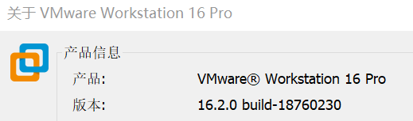

[ubuntu-18.04.6-live-server-amd64.iso](https://releases.ubuntu.com/18.04/ubuntu-18.04.6-live-server-amd64.iso)
## 安装步骤
### 1.虚拟机安装
典型安装方式即可  
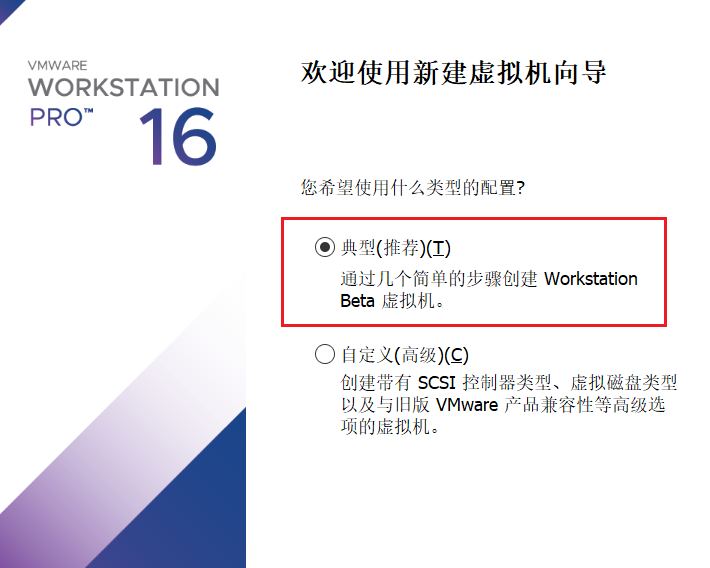

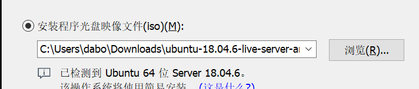

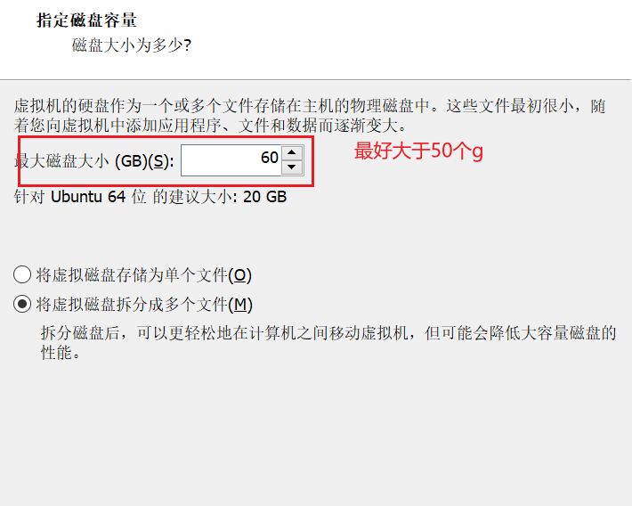
创建完成之后进入ubuntu的安装
注意在分区的时候给根目录分至少40g
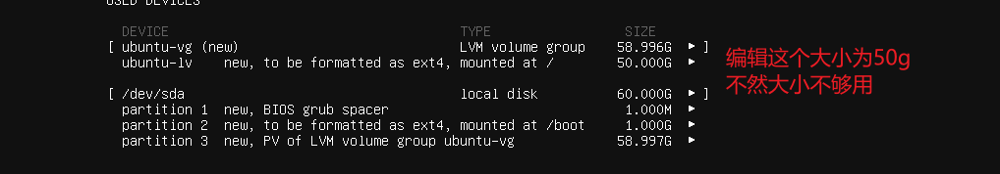

### 2.配置安装环境

```bash
sudo apt upgrade #先更新软件包
sudo apt-get install libncurses5-dev gcc make git exuberant-ctags bc libssl-dev flex bison libelf-dev # 安装编译必要的包
```
### 3.evl的下载与配置

```bash
git clone https://source.denx.de/Xenomai/xenomai4/linux-evl.git #下载evl包
cd linux-evl
git checkout -b evl-5.13 origin/v5.13-evl-rebase #切换到5.13分支
```

配置evl
```bash
make menuconfig
```
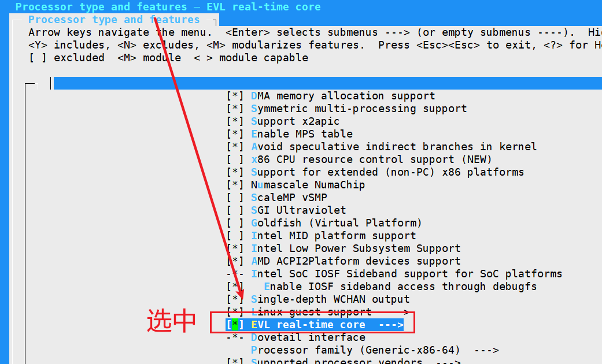

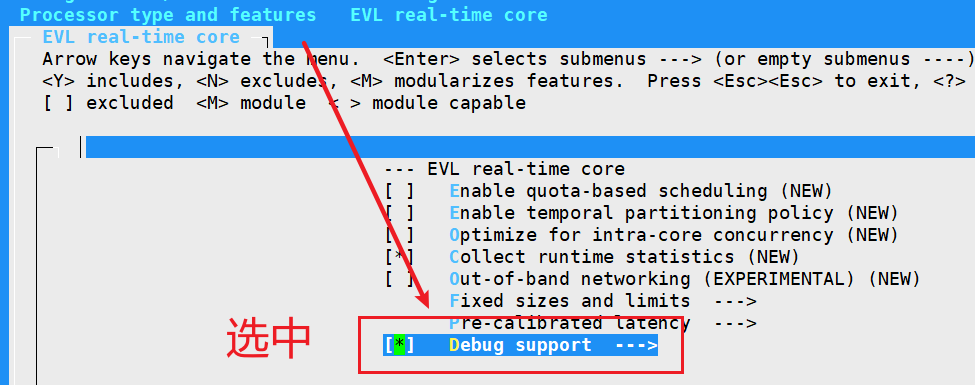

修改.config
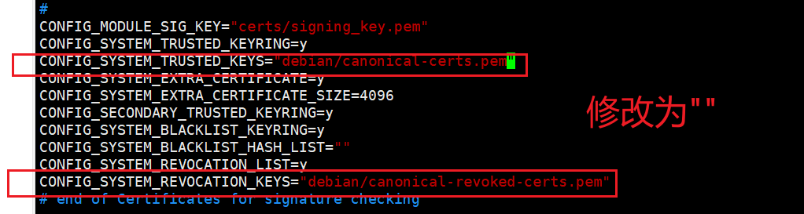

开始编译并安装
```bash
sudo make
sudo make modules_install install
```
之后reboot重启进入Linux内核5.13版本
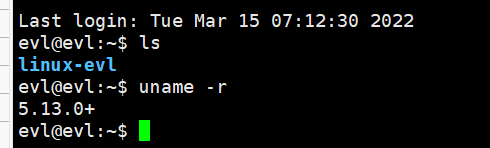

### 4.evl-5.13构建libevl r27
因为装的是小于R29的版本，所以安装教程在这里
[LEGACY LIBEVL BUILD](https://evlproject.org/core/build-libevl-legacy/)

[Git 切换到Tag或Branch分支](https://www.choupangxia.com/2019/11/21/git-tag-branch/)
下载libevl并切换到r27 tag
```git
git clone https://source.denx.de/Xenomai/xenomai4/libevl.git
git checkout r27
```

安装g++
```command
sudo apt install g++
```

编译libevl
```command
$ mkdir /tmp/build-native && cd /tmp/build-native
$ sudo make -C ~/libevl O=$PWD UAPI=~/linux-evl DESTDIR=/usr/evl install
```

然后加入以下到~/.bashrc中
```command
export LD_LIBRARY_PATH=$LD_LIBRARY_PATH:/usr/evl/lib
export LD_LIBRARY_PATH=$LD_LIBRARY_PATH:/usr/lib
export PATH=$PATH:/usr/evl/bin
```

完成后执行
```command
source ~/.bashrc
```
[Can't access shared libraries when running with sudo](https://raspberrypi.stackexchange.com/questions/583/cant-access-shared-libraries-when-running-with-sudo)
然后进入sudo bash并测试evl
```bash
sudo bash
evl test
```

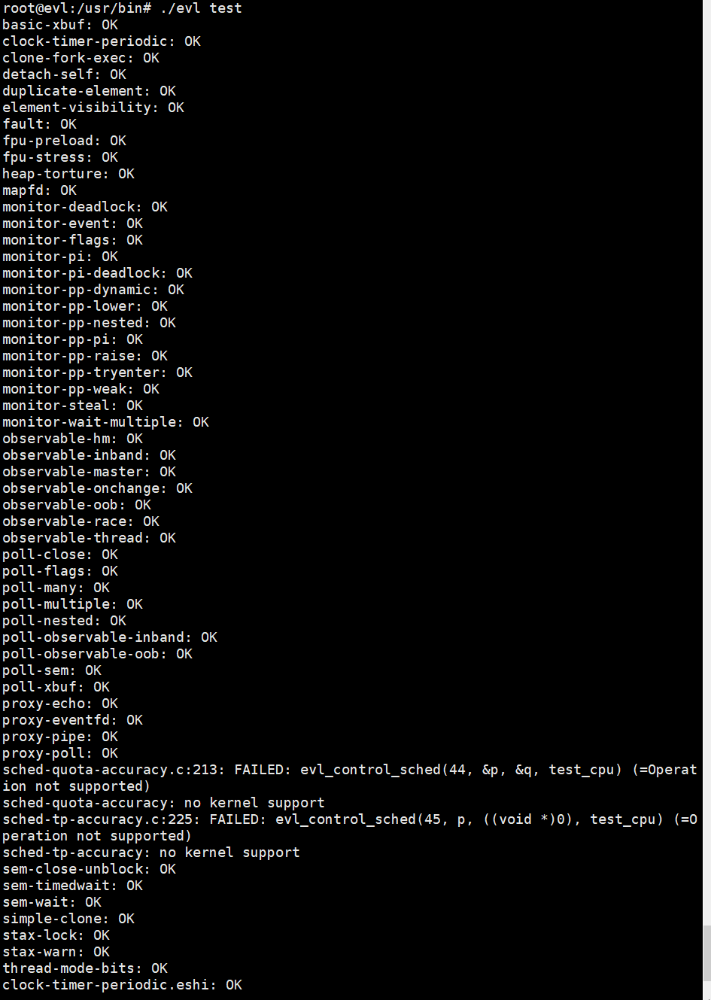

输出结果，安装成功！！！

### 5.测试.c文件
引入环境变量C_INCLUDE_PATH和CPLUS_INCLUDE_PATH，目标目录是libevl的include
加入如下语句到~/.bashrc中
```bash
export C_INCLUDE_PATH=$C_INCLUDE_PATH:/usr/evl/include
export CPLUS_INCLUDE_PATH=$CPLUS_INCLUDE_PATH:/usr/evl/include
```
然后
```bash
source ~/.bashrc
```

[evl官网init测试用例](https://evlproject.org/core/user-api/init/)
保存如下代码到test.c
```c
#include <error.h>
#include <evl/evl.h>

int main(int argc, char *const argv[])
{
	int ret;

	ret = evl_init();
	if (ret)
		error(1, -ret, "evl_init() failed");
	...
	return 0;
}
```
使用如下命令即可成功编译
```bash
gcc test.c /usr/evl/lib/libevl.so -o t
```


**至此，evl与libevl全部成功安装！！**

## 遇到的问题
### error：kernel does not meet out ABI requirements（libevl版本选择错误）
一开始选择了r32，用了meson进行安装，结果出现了如下错误
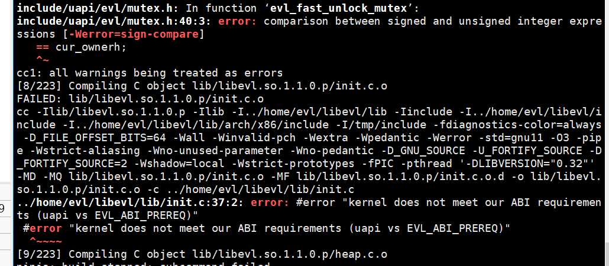

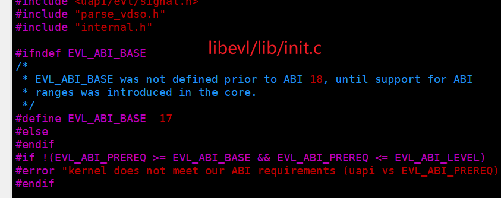

可以看到是EVL_ABI_PREREQ不满足介于[EVL_ABI_BASE，EVL_ABI_LEVEL]的要求
后来在查[evl文档](https://evlproject.org/devprocess/)里发现了这句话

EVL_ABI_PREREQ必须介于[EVL_ABI_BASE，EVL_ABI_LEVEL]之间
1. 在libevl找到EVL_ABI_PREREQ的值
2. 在linux-evl源码中找到EVL_ABI_BASE和EVL_ABI_LEVEL的值
3. 对比之后如果满足EVL_ABI_PREREQ介于[EVL_ABI_BASE，EVL_ABI_LEVEL]之间，那么说明这个libevl的版本是可用的

EVL_ABI_PREREQ定义在libevl/include/evl/evl.h里面
[r27](https://source.denx.de/Xenomai/xenomai4/libevl/-/blob/r27/include/evl/evl.h#L25)
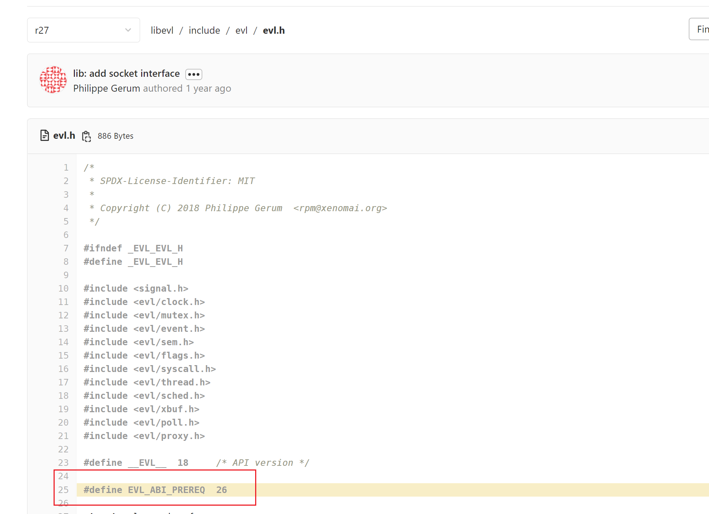

EVL_ABI_BASE和EVL_ABI_LEVEL在/include/uapi/evl/control.h里面
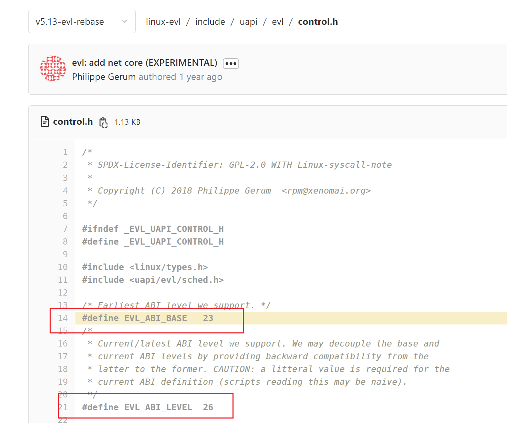

[evl-5.13](https://source.denx.de/Xenomai/xenomai4/linux-evl/-/blob/v5.13-evl-rebase/include/uapi/evl/control.h#L14)的[EVL_ABI_BASE，EVL_ABI_LEVEL] =  [23,26]
经对比，evl-5.13可用的libevl版本为[r17](https://source.denx.de/Xenomai/xenomai4/libevl/-/blob/r17/include/evl/evl.h)――[r27](https://source.denx.de/Xenomai/xenomai4/libevl/-/blob/r27/include/evl/evl.h)

综上，5.13的evl要选择r27版本的libevl

### 编译时找不到文件（evl/evl.h: No such file or directory）
[gcc指定头文件及动态链接库路径](https://blog.csdn.net/trochiluses/article/details/48491539)
引入环境变量，编辑~/.bashrc，加入如下语句
```bash
export C_INCLUDE_PATH=$C_INCLUDE_PATH:/usr/evl/include
export CPLUS_INCLUDE_PATH=$CPLUS_INCLUDE_PATH:/usr/evl/include
```
之后
```bash
source ~/.bashrc
```

### unknown type name ‘useconds_t’; did you mean ‘suseconds_t’?
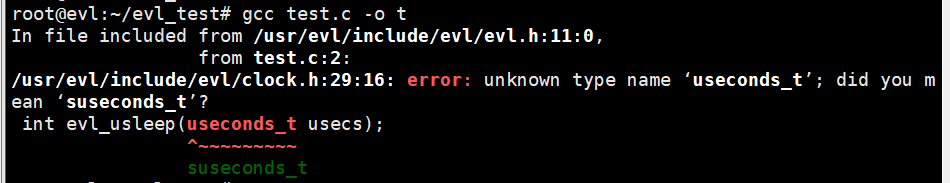
根据错误提示修改即可

### undefined reference to `evl_init'
[GCC 将动态链接库链接到可执行文件](http://c.biancheng.net/view/2385.html)


 编译时未指定动态链接库libevl.so应该使用如下命令加入动态链接库
```bash
gcc test.c /usr/evl/lib/libevl.so -o t
```

## 如果安装了高版本的evl，可参考如下libevl安装方式
### 1安装python3.7
[ubuntu18安装Python3.7](https://zhuanlan.zhihu.com/p/129867344)
```bash
sudo apt update
sudo apt upgrade -y
```

```bash
sudo apt install build-essential zlib1g-dev libbz2-dev libncurses5-dev libgdbm-dev libnss3-dev libssl-dev libreadline-dev libffi-dev wget
```
下载解压编译并安装
```bash
wget https://www.python.org/ftp/python/3.7.4/Python-3.7.4.tgz
tar -xzvf Python-3.7.4.tgz
cd Python-3.7.4
./configure --prefix=/usr/local/src/python37  # 配置安装位置
sudo make
sudo make install
```

建立软连接
```bash
sudo ln -s /usr/local/src/python37/bin/python3.7 /usr/bin/python3.7
sudo ln -s /usr/local/src/python37/bin/pip3.7 /usr/bin/pip3.7
```

### 2安装ninja
[Ninja安装和基本使用](https://zhuanlan.zhihu.com/p/321882707)
```bash
sudo apt install ninja-build
```
### 3安装meson
[Meson官方安装](https://mesonbuild.com/Getting-meson_zh.html)

```bash
pip3.7 install --user meson
reboot
```
注意要重启，重启后用meson看是否安装成功
### 4.libevl
下载libevl
```git
git clone https://source.denx.de/Xenomai/xenomai4/libevl.git
```

创建并切换目录，这里注意要使用绝对路径，不能使用~作为/home/evl
```bash
mkdir /tmp/build-native && cd /tmp/build-native
meson setup -Dbuildtype=release -Dprefix=/opt/evl -Duapi=/home/evl/linux-evl . /home/evl/libevl
```

否则会出现如下错误，找不到~/目录下的文件
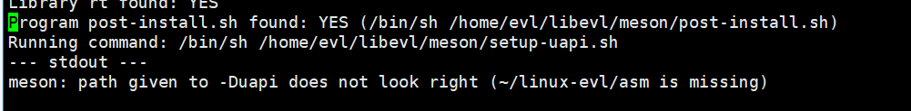

但是直接在sh里面输入~/linux-evl又可以成功找到对应目录，该bug未解
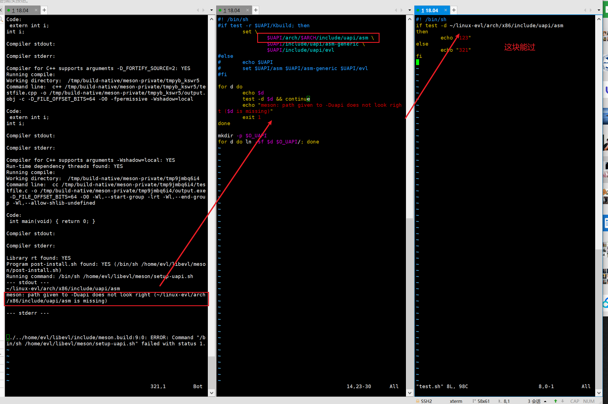

之后
```bash
meson compile
```

未完成......